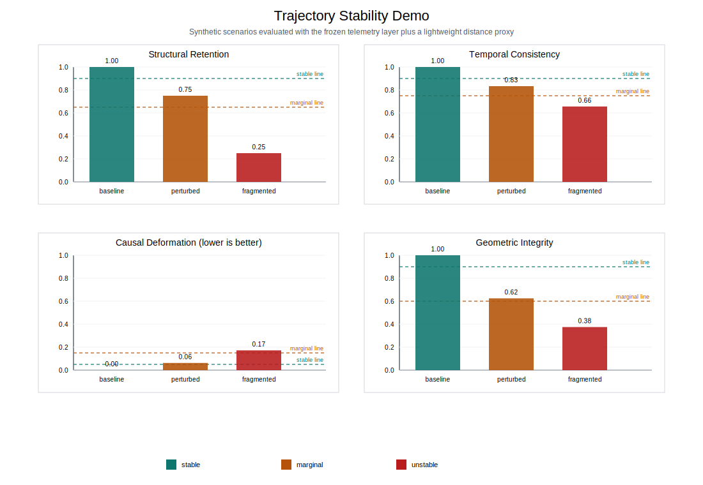

# HAOS-IIP

Emergence diagnostics on a frozen branch-local cochain-Laplacian hierarchy.

Success criterion: running the public reproduction script should produce identical table values and an identical plot to the frozen baseline.

## Overview

HAOS-IIP is a structured numerical research program investigating whether a reproducible emergence ladder can be identified inside a frozen operator hierarchy on discrete graph domains.

The project focuses on:

- bounded feasibility diagnostics
- controlled refinement hierarchies
- frozen telemetry definitions
- reproducible phase bundles

This repository does not assert geometric structure, physical correspondence, or continuum validity. It provides a computational environment for testing whether such structures could stabilize under disciplined constraints.

Public-scope boundary: this reproduces a bounded mesoscopic-to-proto-geometric feasibility arc. It does not claim a continuum limit or physical ontology.

## Scope Of The Program

The program studies emergence inside a frozen branch regime defined by:

- a branch-local cochain-Laplacian operator family
- deterministic initialization routines
- matched altered-connectivity controls
- shared telemetry metrics across phases

Primary research questions include:

- Does a stable propagation band form under refinement?
- Can temporal ordering emerge from branch-internal dynamics?
- Does a consistent causal influence structure close?
- Can proto-geometric distance surrogates stabilize?

All conclusions are framed as feasibility statements, not ontological claims.

## Repository Structure

```text
phase3-stability/ ... phase18-distance-surrogate/  frozen phase bundles and diagnostics
continuum-sketch/                                  low-cost post-processing scaling test
examples/                                          one-command public reproduction spine
telemetry/                                         frozen emergence metrics
haos_core/                                         shared core primitives
papers/                                            numbered PDF releases and drafts
ai/                                                saved Codex prompts and workflow support
```

Each phase bundle follows a uniform contract:

```text
build_*.py
phase*_manifest.json
phase*_summary.md
runs/
diagnostics/
(optional) plots/
```

## Quick Start

For a cold external read, start with the narrow public reproduction path:

```bash
python3 examples/quick_reproduce.py
```

This one command:

- checks the frozen Phase XV-XVIII bundles
- rebuilds the artifact-only continuum sketch
- writes a compact public table and figure under `examples/output/`
- verifies both against `examples/expected_output.csv` and `examples/expected_plot.svg`

If you only want to validate a single frozen bundle, run an integrity check:

```bash
python3 run_phase.py 18 --check
```

Example:

```bash
python3 run_phase.py 10 --check
```

No new simulations are required to validate frozen results.

## Telemetry Demo

HAOS-IIP also exposes a small telemetry-based structural-stability diagnostic. This demo illustrates how HAOS-IIP telemetry can be used as a structural-stability diagnostic for evolving graph-like systems. It is not a claim about physical spacetime emergence.

Run the default demo bundle:

```bash
python3 -m haos_iip.demo stability
```

Request a machine-readable payload for one scenario:

```bash
python3 -m haos_iip.demo stability baseline --json
```

Run a deterministic scan grid:

```bash
python3 -m haos_iip.demo stability --scan noise=0.00:0.10:0.05 connectivity=0.00:0.20:0.10
```

Run a deterministic generated variant:

```bash
python3 -m haos_iip.demo stability baseline --noise 0.05 --connectivity-drop 0.2 --cluster-split
```

Public metric aliases:

- `structural_retention` = persistence
- `temporal_consistency` = ordering
- `causal_deformation` = depth drift
- `geometric_integrity` = distance coherence



Short note:

- [A Minimal Structural-Stability Oracle Based on Frozen HAOS-IIP Telemetry](/Volumes/Samsung%20T5/2026/HAOS/HAOS%20DOCS/HAOS-IIP/docs/notes/applications/A_Minimal_Structural_Stability_Oracle_Based_on_Frozen_HAOS_IIP_Telemetry_v1.md)

## Program Status

Current milestone:

Emergent temporal ordering, causal closure, and proto-geometric distance-surrogate feasibility established within the frozen branch regime.

Milestone anchor:

- [PROGRAM_STATE_MILESTONE_18.md](PROGRAM_STATE_MILESTONE_18.md)

## Reproducibility Contract

Core experimental layers are frozen and defined in:

- [API_CONTRACT.md](API_CONTRACT.md)
- [telemetry/frozen_metrics.py](telemetry/frozen_metrics.py)

This guarantees:

- stable operator definitions
- consistent initialization rules
- invariant telemetry formulas
- matched control construction

Emergence diagnostics rely only on these frozen interfaces.

## Continuum-Sketch Layer

A minimal post-processing protocol for low-cost scaling inspection is provided in:

- [continuum-sketch/](continuum-sketch/)

This stage performs:

- refinement trend checks
- propagation-band stability inspection
- proto-distance scaling diagnostics

It does not introduce new dynamics.

## Papers

Numbered synthesis papers are released in:

- [papers/pdf_releases/](papers/pdf_releases/)
- [papers/pdf_releases/INDEX.md](papers/pdf_releases/INDEX.md)

Example release:

- [43.1 Ordering, Causal Closure, and Proto-Geometric Distance-Surrogate Feasibility on a Frozen Branch-Local Cochain-Laplacian Hierarchy.pdf](papers/pdf_releases/43.1%20Ordering,%20Causal%20Closure,%20and%20Proto-Geometric%20Distance-Surrogate%20Feasibility%20on%20a%20Frozen%20Branch-Local%20Cochain-Laplacian%20Hierarchy.pdf)

## Limitations

This repository intentionally avoids:

- physical interpretation claims
- geometric reconstruction claims
- continuum field-theory derivations
- cosmological or ontological assertions

The program is strictly a numerical emergence feasibility study.

## Citation

If you use results or methods from this repository, please cite this work using:

- [CITATION.cff](CITATION.cff)

## License

See:

- [LICENSE](LICENSE)
- [COPYRIGHT.md](COPYRIGHT.md)
- [THEORY_NOTICE.md](THEORY_NOTICE.md)

## Author

Tomislav Rupić  
Independent multimedia researcher and computational emergence practitioner.
Website: [tomislav-rupic.com](https://tomislav-rupic.com)  
Email: [tom.d.vox@gmail.com](mailto:tom.d.vox@gmail.com)
