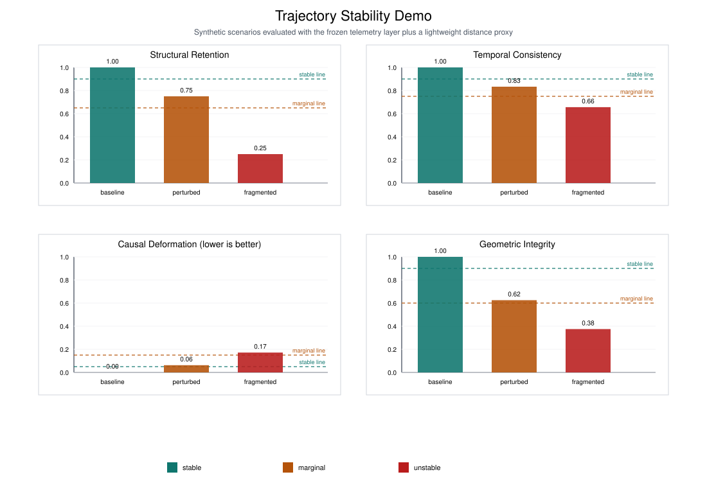

# HAOS-IIP

**Harmonic Address Operating System - Interaction Invariant Physics**

A large-scale, disciplined numerical research program exploring reproducible emergence of stability, temporal ordering, causal closure, and proto-geometric structures inside **frozen branch-local cochain-Laplacian hierarchies**.

**200+ commits | 18+ phased bundles | strict reproducibility | frozen baselines + telemetry**

### One-Sentence Summary

This repository demonstrates that a coherent, multi-hundred-page-equivalent computational research arc (stability -> scalar-carrier geometry -> cautious physics-bridge observables -> bounded external-data sidecars) can be built and kept verifiable using structured workflows and current tools.

### Success Criterion

```bash
python3 examples/quick_reproduce.py
```

This command must reproduce identical public tables and plots against the frozen baselines. No new simulations are required for validation.

### Why This Exists

Most emergence / discrete-physics projects stay small and informal. HAOS-IIP deliberately goes the other way:

- uniform phase contracts
- frozen manifests + telemetry
- one-command public reproduction
- explicit separation between computational results and ontological interpretation

It does not claim to derive real physics, spacetime, or a Theory of Everything. It asks a narrower, testable question:

> Can a bounded emergence ladder stabilize and remain reproducible under strict discrete constraints?

So far, inside the tested families, the answer is yes: multiple milestones close under frozen reproduction and explicit controls. Open boundaries remain labeled as open.

### Quick Start For New Readers

```bash
git clone https://github.com/tomislavrupic/HAOS-IIP.git
cd HAOS-IIP
python3 examples/quick_reproduce.py
```

This gives you:

- verified Phase XV-XVIII results
- continuum-sketch post-processing
- output in `examples/output/`

For a single phase integrity check:

```bash
python3 run_phase.py 18 --check
```

### Visual Orientation

- [Deterministic validation hierarchy, Phases V-X](Images/HAOS-IIP.png)
- [Emergent feasibility hierarchy, Phases X-XVIII](Images/Hierarchy%20of%20Emergent%20Feasibility%20Phases.png)
- [Full media index](docs/media/MEDIA_INDEX.md)

<p align="center">
  
</p>

## Overview

HAOS-IIP is a structured numerical research program investigating whether a reproducible emergence ladder can be identified inside a frozen operator hierarchy on discrete graph domains.

The project focuses on:

- bounded feasibility diagnostics
- controlled refinement hierarchies
- frozen telemetry definitions
- reproducible phase bundles

This repository does not assert broad physical correspondence, continuum ontology, or spacetime claims. It provides a computational environment for testing whether such structures could stabilize under disciplined constraints.

Public-scope boundary: this reproduces a bounded mesoscopic-to-proto-geometric feasibility arc, now including a tested scalar-carrier geometry closure on one common kernel-graph family. It does not claim a general continuum limit or physical ontology.

## Visual Entry Points

The landing page uses only a small curated media set so a cold reader can orient quickly without getting buried in assets.

- [Deterministic validation hierarchy, Phases V-X](Images/HAOS-IIP.png)
- [Emergent feasibility hierarchy, Phases X-XVIII](Images/Hierarchy%20of%20Emergent%20Feasibility%20Phases.png)
- [Phase V diagnostic data readout](Images/HAOS-IIP%20Phase%20V%20Diagnostic%20Data%20Readout.png)
- [Morphological stability network design](Images/Morphological%20Stability%20Network%20Design.png)
- [Proto-particle feasibility study diagram](Images/Proto-Particle%20Feasibility%20Study%20Diagram.png)
- [HAOS-IIP system ledger](Images/HAOS-IIP_System_Ledger.pdf)
- [HAOS-IIP emergence telemetry](Images/HAOS-IIP_EMERGENCE_TELEMETRY.pdf)
- [System Check: The Cautious Bridge](Images/System_Check__The_Cautious_Bridge.mp4)
- [Media index](docs/media/MEDIA_INDEX.md)
- [Image vault](Images/README.md)

## Scope Of The Program

The program studies emergence inside a frozen branch regime defined by:

- a branch-local cochain-Laplacian operator family
- deterministic initialization routines
- matched altered-connectivity controls
- shared telemetry metrics across phases

Primary research questions include:

- Does a stable propagation band form under refinement?
- Can temporal ordering emerge from branch-internal dynamics?
- Does a consistent causal influence structure close?
- Can proto-geometric distance surrogates stabilize?

All conclusions are framed as feasibility statements, not ontological claims.

## Repository Structure

```text
phase3-stability/ ... phase18-distance-surrogate/  frozen phase bundles and diagnostics
continuum-sketch/                                  low-cost post-processing scaling test
experiments/physics_bridge/                        external physics-facing proxy readout
experiments/materials_bridge/                      external materials-data sidecar probes
examples/                                          one-command public reproduction spine
telemetry/                                         frozen emergence metrics
haos_core/                                         shared core primitives
papers/                                            numbered PDF releases and drafts
ai/                                                saved Codex prompts and workflow support
```

Each phase bundle follows a uniform contract:

```text
build_*.py
phase*_manifest.json
phase*_summary.md
runs/
diagnostics/
(optional) plots/
```

## Quick Start

For a cold external read, start with the narrow public reproduction path:

```bash
python3 examples/quick_reproduce.py
```

This one command:

- checks the frozen Phase XV-XVIII bundles
- rebuilds the artifact-only continuum sketch
- writes a compact public table and figure under `examples/output/`
- verifies both against `examples/expected_output.csv` and `examples/expected_plot.svg`

If you only want to validate a single frozen bundle, run an integrity check:

```bash
python3 run_phase.py 18 --check
```

Example:

```bash
python3 run_phase.py 10 --check
```

No new simulations are required to validate frozen results.

To regenerate the external physics-bridge proxy table without changing the default reproduction contract:

```bash
python3 examples/quick_reproduce.py --physics-observables-only
```

To rerun the external ferron / NbOI2 materials bridge sidecar:

```bash
uv run --with numpy --with matplotlib --with openpyxl python experiments/materials_bridge/ferron_coherence_demo/run_ferron_coherence_demo.py
```

This sidecar is outside the frozen phase contract. It downloads public Figshare
source data for a ferron / NbOI2 paper, records raw-file provenance, parses
available time traces and spectra, audits published target-band STFT intensity
traces, runs a derived computed-from-time-trace STFT diagnostic, and reports a
bounded unified persistence proxy. It does not claim that ferrons prove
HAOS-IIP, and it preserves `NO_STFT_DATA_FOUND` for raw time-frequency grids.

## Telemetry Demo

HAOS-IIP also exposes a small telemetry-based structural-stability diagnostic. This demo illustrates how HAOS-IIP telemetry can be used as a structural-stability diagnostic for evolving graph-like systems. It is not a claim about physical spacetime emergence.

Run the default demo bundle:

```bash
python3 -m haos_iip.demo stability
```

Request a machine-readable payload for one scenario:

```bash
python3 -m haos_iip.demo stability baseline --json
```

Run a deterministic scan grid:

```bash
python3 -m haos_iip.demo stability --scan noise=0.00:0.10:0.05 connectivity=0.00:0.20:0.10
```

Run a deterministic generated variant:

```bash
python3 -m haos_iip.demo stability baseline --noise 0.05 --connectivity-drop 0.2 --cluster-split
```

Public metric aliases:

- `structural_retention` = persistence
- `temporal_consistency` = ordering
- `causal_deformation` = depth drift
- `geometric_integrity` = distance coherence



Short note:

- [A Minimal Structural-Stability Oracle Based on Frozen HAOS-IIP Telemetry](docs/notes/applications/A_Minimal_Structural_Stability_Oracle_Based_on_Frozen_HAOS_IIP_Telemetry_v1.md)

## Program Status

**Current public milestone (65.1 materials bridge sidecar after 53.x physics bridge):**
The bounded HAOS-to-harmonic derivation program is fully executed, the vector validation line is frozen through `51.2`, and the scalar kernel-graph line closes through the `52.x` scalar-carrier releases and the `53.x` physics-bridge observable stack. Release `64.1` adds the first real external materials-data sidecar: a ferron / NbOI2 bridge over public Figshare data from Choe et al. Release `65.1` adds the parallel spin-sector Line B magnon sidecar for alpha-Fe2O3 with a first-class artifact and explicit raw-data boundary. Both are outside the frozen phase contract and do not modify frozen core, frozen phases, or telemetry definitions.

The public repository now contains six stacked bounded results:

- closed derivation ladder: `T1 -> T2 -> T4 -> T5 -> T6 -> T7 -> T8`, plus `F1-F4`
- frozen vector validation spine through `V1-V6b` and clean-baseline identity resolution
- scalar-carrier geometry closure on one common `3D` kernel-graph family, followed by a positive robustness pass, a bounded local metric-field closure, a shell-native response read, an honest open first transient baseline `52.3`, a bounded shell-native clean-line current closure `52.4`, and a bounded smooth-inhomogeneity transport closure `52.5` on the smooth radial branch
- external physics-bridge observables `53.0`, which separate shell-native inverse-square and power-law closure from raw local-gradient residuals, split localized bump response into weak PASS and stress OPEN boundaries, and now close the tested disorder-native seed margin
- external materials bridge `64.1`, which loads real published ferron / NbOI2 source data, audits `15/15` target-window spectral records near `3.13 THz`, reports mean spectral recoverability `0.928455`, parses published target-band STFT intensity traces as post-processed envelope data, computes a derived time-trace STFT diagnostic with mean envelope correlation `0.995318`, and records a unified persistence proxy `0.957192` while preserving `NO_STFT_DATA_FOUND` for raw time-frequency grids
- external spin-sector materials bridge `65.1`, which records the alpha-Fe2O3 magnon address-stability artifact with seeded persistence proxy `0.902`, literature-reported group velocity range `17.31-24.43 km/s`, and `NO_PUBLIC_STFT_GRID_FOUND` / `NO_RAW_PUBLIC_DATA_LOADED` boundaries until a local raw-data audit is committed

Milestone anchors:

- [65.1 Materials Bridge Line B - Magnon Address Stability in alpha-Fe2O3](papers/pdf_releases/65.1%20Materials%20Bridge%20Line%20B%20-%20Magnon%20Address%20Stability%20in%20alpha-Fe2O3%20for%20HAOS-IIP.pdf)
- [Materials Bridge Line B magnon sidecar](experiments/materials_bridge/magnon_alpha_fe2o3_audit/)
- [64.1 Materials Bridge Line A - Ferron Coherence Recoverability Probe](papers/pdf_releases/64.1%20Materials%20Bridge%20Line%20A%20-%20Ferron%20Coherence%20Recoverability%20Probe%20for%20HAOS-IIP.pdf)
- [Materials Bridge Line A ferron sidecar](experiments/materials_bridge/ferron_coherence_demo/)
- [Physics Bridge 53.0](docs/notes/foundations/HAOS_IIP_Physics_Bridge_53_0_v1.md)
- [Seed-Universal Disorder Flux 53.4](docs/notes/foundations/HAOS_IIP_Seed_Universal_Disorder_Flux_53_4_v1.md)
- [Power-Law Scaling 53.3](docs/notes/foundations/HAOS_IIP_Power_Law_Scaling_53_3_v1.md)
- [Localized Bump Response 53.2](docs/notes/foundations/HAOS_IIP_Localized_Bump_Response_53_2_v1.md)
- [Physics Bridge Observable Summary](experiments/physics_bridge/results/physics_observables_summary.md)
- [53.4 Seed-Universal Disorder Flux Release](papers/pdf_releases/53.4%20Seed-Universal%20Disorder%20Flux%20Release%20for%20HAOS-IIP.pdf)
- [53.3 Power-Law Scaling Boundary Release](papers/pdf_releases/53.3%20Power-Law%20Scaling%20Boundary%20Release%20for%20HAOS-IIP.pdf)
- [53.2 Localized Bump Response Threshold Release](papers/pdf_releases/53.2%20Localized%20Bump%20Response%20Threshold%20Release%20for%20HAOS-IIP.pdf)
- [53.0 Physics Bridge Observables Release](papers/pdf_releases/53.0%20Physics%20Bridge%20Observables%20Release%20for%20HAOS-IIP.pdf)
- [52.5 Scalar-Carrier Smooth-Inhomogeneity Current-Closure Release](papers/pdf_releases/52.5%20Scalar-Carrier%20Smooth-Inhomogeneity%20Current-Closure%20Release%20for%20HAOS-IIP.pdf)
- [52.4 Scalar-Carrier Shell-Native Current-Closure Release](papers/pdf_releases/52.4%20Scalar-Carrier%20Shell-Native%20Current-Closure%20Release%20for%20HAOS-IIP.pdf)
- [52.1 Scalar-Carrier Recoverability-Gradient Probe Release](papers/pdf_releases/52.1%20Scalar-Carrier%20Recoverability-Gradient%20Probe%20Release%20for%20HAOS-IIP.pdf)
- [51.4 Scalar-Carrier Local Metric-Field Release](papers/pdf_releases/51.4%20Scalar-Carrier%20Local%20Metric-Field%20Release%20for%20HAOS-IIP.pdf)
- [51.3 Scalar-Carrier CP4 Geometry Robustness Release](papers/pdf_releases/51.3%20Scalar-Carrier%20CP4%20Geometry%20Robustness%20Release%20for%20HAOS-IIP.pdf)
- [51.2 Clean-Baseline Identity Resolution and Holonomy-Split Family Labeling Release](papers/pdf_releases/51.2%20Clean-Baseline%20Identity%20Resolution%20and%20Holonomy-Split%20Family%20Labeling%20Release%20for%20HAOS-IIP.pdf)
- [51.1 Validated Active-Branch Closure and the Open Clean-Baseline Identity Program](papers/pdf_releases/51.1%20Validated%20Active-Branch%20Closure%20and%20the%20Open%20Clean-Baseline%20Identity%20Program%20for%20HAOS-IIP.pdf)
- [Bounded CP4 Geometry Closure on the Scalar Kernel-Graph](docs/notes/foundations/HAOS_IIP_Bounded_CP4_Geometry_Closure_on_Scalar_Kernel_Graph_v1.md)
- [Scalar-Carrier CP4 Robustness Pass](docs/notes/foundations/HAOS_IIP_Scalar_Carrier_CP4_Robustness_Pass_v1.md)
- [Scalar-Carrier CP4 Geometry Robustness 51.3](docs/notes/foundations/HAOS_IIP_Scalar_Carrier_CP4_Geometry_Robustness_51_3_v1.md)
- [Scalar-Carrier Local Metric Field 51.4](docs/notes/foundations/HAOS_IIP_Scalar_Carrier_Local_Metric_Field_51_4_v1.md)
- [Scalar-Carrier Recoverability Gradient 52.1](docs/notes/foundations/HAOS_IIP_Scalar_Carrier_Recoverability_Gradient_52_1_v1.md)
- [Scalar-Carrier Current Closure 52.3](docs/notes/foundations/HAOS_IIP_Scalar_Carrier_Current_Closure_52_3_v1.md)
- [Scalar-Carrier Current Closure 52.4](docs/notes/foundations/HAOS_IIP_Scalar_Carrier_Current_Closure_52_4_v1.md)
- [Scalar-Carrier Smooth-Inhomogeneity Current Closure 52.5](docs/notes/foundations/HAOS_IIP_Scalar_Carrier_Smooth_Inhomogeneity_Current_Closure_52_5_v1.md)
- [Physics Bridge 53.0](docs/notes/foundations/HAOS_IIP_Physics_Bridge_53_0_v1.md)
- [Root-Note Guiding Principle v1](docs/notes/foundations/HAOS_IIP_Root_Note_Guiding_Principle_v1.md) (external interpretive layer only; frozen stack unchanged)
- [Purified Source Cube Guiding Scaffold v1](docs/notes/foundations/HAOS_IIP_Purified_Source_Cube_Guiding_Scaffold_v1.md) (external mnemonic scaffold only; frozen stack unchanged)
- [Seed-Universal Disorder Flux 53.4](docs/notes/foundations/HAOS_IIP_Seed_Universal_Disorder_Flux_53_4_v1.md)
- [Power-Law Scaling 53.3](docs/notes/foundations/HAOS_IIP_Power_Law_Scaling_53_3_v1.md)
- [Localized Bump Response 53.2](docs/notes/foundations/HAOS_IIP_Localized_Bump_Response_53_2_v1.md)
- [PROGRAM_STATE_MILESTONE_18.md](PROGRAM_STATE_MILESTONE_18.md) (original geometry-emergence baseline)

External-data sidecar update:

- [Materials Bridge Line A ferron sidecar](experiments/materials_bridge/ferron_coherence_demo/) loads real published Figshare data for Choe et al., parses `9` time traces and `6` spectra or peak records, audits `15` target-window spectral records near `3.13 THz`, and reports mean peak frequency `3.13893 THz`, mean spectral recoverability `0.928455`, and no detected `k_star` under the current proxy thresholds.
- The published Fig. 2d target-band STFT intensity traces are parsed as post-processed envelope data: `8` traces, `216` time points, group-velocity proxies of `58.8 km/s` for `96 nm` and `100 km/s` for `224 nm`, and monotonic peak delay in both thickness groups.
- A derived computed-from-time-trace STFT diagnostic over raw Fig. 2a/2b traces reports mean envelope correlation `0.995318` against the published target-band traces and mean computed group velocity `101754 m/s`.
- The unified persistence summary reports `ferron_persistence_proxy=0.957192`.
- The raw STFT/time-frequency audit inspected the raw XLSX files and found no validated raw time-frequency grid; therefore no raw STFT-grid recoverability claim is made.
- This is an external-data bridge validation and bounded persistence summary only. It does not modify the frozen core, does not modify frozen phases, and does not prove HAOS-IIP.
- [Ferron extension testable signatures](predictions/ferron_extension_testable_signatures.md) turns the sidecar into four falsifiable prediction records: polar-mode address selection, thickness / boundary propagation dependence, re-addressing after secondary perturbation, and cross-dataset narrowband control discrimination.
- [Materials Bridge Line B magnon sidecar](experiments/materials_bridge/magnon_alpha_fe2o3_audit/) records the alpha-Fe2O3 spin-sector bridge artifact with persistence proxy `0.902`, reported velocity range `17.31-24.43 km/s`, and raw-data boundaries `NO_RAW_PUBLIC_DATA_LOADED` and `NO_PUBLIC_STFT_GRID_FOUND`.
- [Magnon address stability testable signatures](predictions/magnon_address_stability_testable_signatures.md) adds four spin-sector prediction records seeded by the ferron bridge and the alpha-Fe2O3 Line B audit anchor; local raw-data reproduction remains pending.

Phase 66 translation and hostile-audit rule:

- [Phase 66 - Translation and Hostile-Audit Layer](docs/notes/foundations/HAOS_IIP_Phase_66_Translation_and_Hostile_Audit_Layer_v1.md) is the corrective public-facing layer for the next phase of the program.
- [Canonical entry paper skeleton](docs/notes/foundations/HAOS_IIP_Canonical_Entry_Paper_Skeleton_v1.md) is the first Phase 66 artifact and defines the entry-door structure for an outside technical reader.
- [Core translation table](docs/notes/foundations/HAOS_IIP_Core_Translation_Table_v1.md) maps HAOS-IIP terms into operational standard-language meanings, numerical tests, non-claims, nearby concepts, and failure conditions.
- Core rule: no expansion before translation.
- The purpose is to translate HAOS-IIP into standard mathematical and computational language, define failure gates, compare against nearby frameworks, and make the program easier to reproduce, inspect, attack, and improve.
- Corrected public posture: HAOS-IIP is a reproducible computational exploration of emergence, recoverability, and operator-derived structure in discrete interaction systems. It does not yet derive known physics; its current value is methodological, diagnostic, and exploratory.

## Reproducibility Contract

Core experimental layers are frozen and defined in:

- [API_CONTRACT.md](API_CONTRACT.md)
- [telemetry/frozen_metrics.py](telemetry/frozen_metrics.py)

This guarantees:

- stable operator definitions
- consistent initialization rules
- invariant telemetry formulas
- matched control construction

Emergence diagnostics rely only on these frozen interfaces.

## Continuum-Sketch Layer

The bounded continuum-facing tranche, including scalar convergence controls, harmonic/coexact sector separation, active-sector transport machinery, and the scalar-carrier `CP4` geometry bridge, is now frozen in the public repo.

A minimal post-processing protocol for low-cost scaling inspection is provided in:

- [continuum-sketch/](continuum-sketch/)

Current scalar geometry-closure notes:

- [Bounded CP4 Geometry Closure on the Scalar Kernel-Graph](docs/notes/foundations/HAOS_IIP_Bounded_CP4_Geometry_Closure_on_Scalar_Kernel_Graph_v1.md)
- [Scalar-Carrier CP4 Robustness Pass](docs/notes/foundations/HAOS_IIP_Scalar_Carrier_CP4_Robustness_Pass_v1.md)
- [Scalar-Carrier Local Metric Field 51.4](docs/notes/foundations/HAOS_IIP_Scalar_Carrier_Local_Metric_Field_51_4_v1.md)
- [Scalar-Carrier Recoverability Gradient 52.1](docs/notes/foundations/HAOS_IIP_Scalar_Carrier_Recoverability_Gradient_52_1_v1.md)
- [Scalar-Carrier Current Closure 52.3](docs/notes/foundations/HAOS_IIP_Scalar_Carrier_Current_Closure_52_3_v1.md)
- [Scalar-Carrier Current Closure 52.4](docs/notes/foundations/HAOS_IIP_Scalar_Carrier_Current_Closure_52_4_v1.md)
- [Scalar-Carrier Smooth-Inhomogeneity Current Closure 52.5](docs/notes/foundations/HAOS_IIP_Scalar_Carrier_Smooth_Inhomogeneity_Current_Closure_52_5_v1.md)
- [Physics Bridge 53.0](docs/notes/foundations/HAOS_IIP_Physics_Bridge_53_0_v1.md)
- [Raw Gradient Shape Audit 53.5](docs/notes/foundations/HAOS_IIP_Raw_Gradient_Shape_Audit_53_5_v1.md) (external sidecar audit only; canonical bridge rows unchanged)
- [Seed-Universal Disorder Flux 53.4](docs/notes/foundations/HAOS_IIP_Seed_Universal_Disorder_Flux_53_4_v1.md)
- [Power-Law Scaling 53.3](docs/notes/foundations/HAOS_IIP_Power_Law_Scaling_53_3_v1.md)
- [Localized Bump Response 53.2](docs/notes/foundations/HAOS_IIP_Localized_Bump_Response_53_2_v1.md)

This stage performs:

- refinement trend checks
- propagation-band stability inspection
- proto-distance scaling diagnostics

It does not introduce new dynamics.

## Papers

Latest releases:

- [65.1 Materials Bridge Line B - Magnon Address Stability in alpha-Fe2O3 for HAOS-IIP](papers/pdf_releases/65.1%20Materials%20Bridge%20Line%20B%20-%20Magnon%20Address%20Stability%20in%20alpha-Fe2O3%20for%20HAOS-IIP.pdf)
- [64.1 Materials Bridge Line A - Ferron Coherence Recoverability Probe for HAOS-IIP](papers/pdf_releases/64.1%20Materials%20Bridge%20Line%20A%20-%20Ferron%20Coherence%20Recoverability%20Probe%20for%20HAOS-IIP.pdf)
- [53.4 Seed-Universal Disorder Flux Release](papers/pdf_releases/53.4%20Seed-Universal%20Disorder%20Flux%20Release%20for%20HAOS-IIP.pdf)
- [53.3 Power-Law Scaling Boundary Release](papers/pdf_releases/53.3%20Power-Law%20Scaling%20Boundary%20Release%20for%20HAOS-IIP.pdf)
- [53.2 Localized Bump Response Threshold Release](papers/pdf_releases/53.2%20Localized%20Bump%20Response%20Threshold%20Release%20for%20HAOS-IIP.pdf)
- [53.0 Physics Bridge Observables Release](papers/pdf_releases/53.0%20Physics%20Bridge%20Observables%20Release%20for%20HAOS-IIP.pdf)
- [52.5 Scalar-Carrier Smooth-Inhomogeneity Current-Closure Release](papers/pdf_releases/52.5%20Scalar-Carrier%20Smooth-Inhomogeneity%20Current-Closure%20Release%20for%20HAOS-IIP.pdf)
- [52.4 Scalar-Carrier Shell-Native Current-Closure Release](papers/pdf_releases/52.4%20Scalar-Carrier%20Shell-Native%20Current-Closure%20Release%20for%20HAOS-IIP.pdf)
- [52.1 Scalar-Carrier Recoverability-Gradient Probe Release](papers/pdf_releases/52.1%20Scalar-Carrier%20Recoverability-Gradient%20Probe%20Release%20for%20HAOS-IIP.pdf)
- [51.4 Scalar-Carrier Local Metric-Field Release](papers/pdf_releases/51.4%20Scalar-Carrier%20Local%20Metric-Field%20Release%20for%20HAOS-IIP.pdf)
- [51.3 Scalar-Carrier CP4 Geometry Robustness Release](papers/pdf_releases/51.3%20Scalar-Carrier%20CP4%20Geometry%20Robustness%20Release%20for%20HAOS-IIP.pdf)
- [51.2 Clean-Baseline Identity Resolution and Holonomy-Split Family Labeling Release](papers/pdf_releases/51.2%20Clean-Baseline%20Identity%20Resolution%20and%20Holonomy-Split%20Family%20Labeling%20Release%20for%20HAOS-IIP.pdf)
- [51.1 Validated Active-Branch Closure and the Open Clean-Baseline Identity Program](papers/pdf_releases/51.1%20Validated%20Active-Branch%20Closure%20and%20the%20Open%20Clean-Baseline%20Identity%20Program%20for%20HAOS-IIP.pdf)

Numbered synthesis papers are released in:

- [papers/pdf_releases/](papers/pdf_releases/)
- [papers/pdf_releases/INDEX.md](papers/pdf_releases/INDEX.md)

Supporting repository visuals and media are indexed in:

- [docs/media/MEDIA_INDEX.md](docs/media/MEDIA_INDEX.md)
- [Images/README.md](Images/README.md)

Earlier milestone example:

- [43.1 Ordering, Causal Closure, and Proto-Geometric Distance-Surrogate Feasibility on a Frozen Branch-Local Cochain-Laplacian Hierarchy.pdf](papers/pdf_releases/43.1%20Ordering,%20Causal%20Closure,%20and%20Proto-Geometric%20Distance-Surrogate%20Feasibility%20on%20a%20Frozen%20Branch-Local%20Cochain-Laplacian%20Hierarchy.pdf)

## Limitations

This repository intentionally avoids:

- broad physical interpretation claims
- repo-wide or ontological geometry claims
- continuum field-theory derivations beyond the tested bounded windows
- cosmological or ontological assertions

The program remains a bounded numerical emergence and operator-closure study.

## Citation

If you use results or methods from this repository, please cite this work using:

- [CITATION.cff](CITATION.cff)

## License

See:

- [LICENSE](LICENSE)
- [COPYRIGHT.md](COPYRIGHT.md)
- [THEORY_NOTICE.md](THEORY_NOTICE.md)

## Author

Tomislav Rupić  
Independent multimedia researcher and computational emergence practitioner.
Website: [tomislav-rupic.com](https://tomislav-rupic.com)  
Email: [tom.d.vox@gmail.com](mailto:tom.d.vox@gmail.com)
